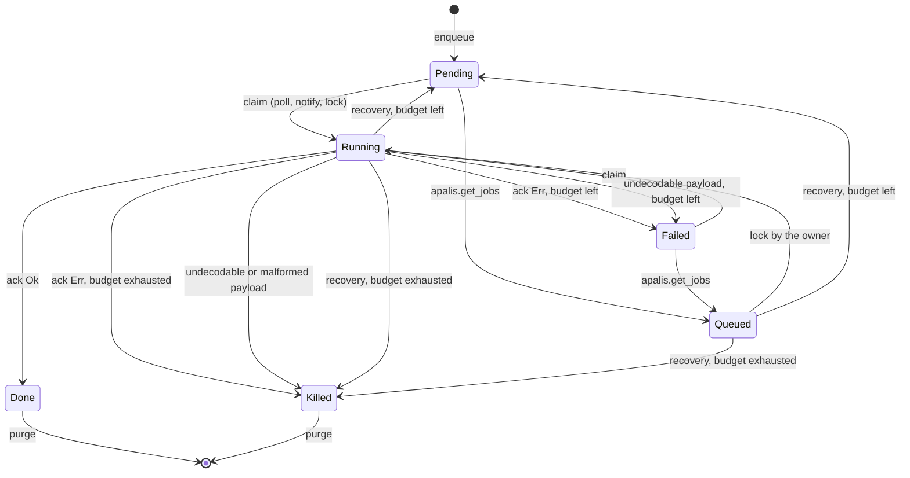

# Task, worker and queue lifecycle

This is the reference for how a task moves through `apalis.jobs`, how a worker
registration in `apalis.workers` is created, kept alive, lost and released,
and when queue data leaves the database. It states the invariants each
operation relies on, which side of the system enforces them, and what the
backend does and does not guarantee. The [README](../README.md) covers usage;
[upgrading.md](upgrading.md) covers schema changes.

## 1. Entities

| Entity | Where | Identity | Lifetime |
|---|---|---|---|
| Task | `apalis.jobs` row | `id` (ULID) | From enqueue until an explicit purge. The worker protocol never deletes a task. |
| Registration | `apalis.workers` row | `(id, worker_type)`: worker name and queue | From the first registration until an explicit prune. The row is kept after the worker stops because completed tasks name it as their last owner. |
| Queue | No row | The `job_type` string (`Config::new(name)`, the task type name by default) | Exists while any task or registration names it. |
| Lease token | `apalis.workers.lease_token` and `PostgresStorage` | One random token per storage instance, shared by clones | Marks which storage instance owns a registration. It fences cooperating instances, not callers with table access. |
| Local lease | In memory, per storage instance, per worker name | | Retired when the instance can no longer vouch for its claims. A retired name refuses further claims and heartbeats in that instance and its clones. |
| Claim epoch | In memory, inside `Task::parts` | `(lock_by, lock_at, attempts)` as the claim returned them | Identifies one execution of one task. Every acknowledgement and release is predicated on it. |

## 2. Task states

`status` is one of six values checked by the schema. The columns next to it
carry the rest of the state.

| Status | Meaning | Owner (`lock_by`, `lock_at`) | `done_at` | Claimable | Terminal |
|---|---|---|---|---|---|
| `Pending` | Waiting to run at `run_at` | none | none | when `run_at <= now()` and `attempts < max_attempts` | no |
| `Queued` | Claimed through the compatibility function `apalis.get_jobs`; the Rust fetchers never produce it | set | none | only by its owner, which moves it to `Running` | no |
| `Running` | Claimed; an execution is expected to acknowledge it | set | none | only by its owner | no |
| `Failed` | The last execution failed and retry budget remains (`attempts < max_attempts`) | last owner kept as history | set | immediately, by any worker | no |
| `Done` | The last execution succeeded | last owner kept as history | set | no | yes |
| `Killed` | No further execution will happen: the budget is exhausted, or the payload cannot be executed | last owner kept, or cleared by quarantine | set | no | yes |

A `Failed` row with `attempts >= max_attempts` is never written by this crate.
`WaitForCompletion` and retention treat such a row, written by another tool,
as terminal.

### Invariants

Enforced by the schema, so no writer can violate them:

- `status` is one of the six values above.
- `0 <= attempts <= max_attempts` and `max_attempts > 0`.
- `priority >= 0`.
- A `Queued` or `Running` row names an owner (`lock_by IS NOT NULL`), and
  that owner is a registration of the same queue (foreign key
  `jobs_lock_by_worker_type_fkey`).
- A `Queued` or `Running` row carries the complete claim, `lock_by` and
  `lock_at`, and a `Pending` row carries neither (`jobs_state_shape_check`).
- `(job_type, idempotency_key)` is unique while the key is not null.

Maintained by every operation of this crate, but not enforced by the schema
(a writer with table access can break them; the claim and recovery
predicates tolerate the result as described in section 3):

- A `Pending` row has no `done_at`.
- `Done` and `Killed` rows have `done_at`.
- `attempts` never decreases. A migration repair and an administrator
  restoring retry budget are the only writers that change it otherwise.
- Every transition out of `Running` or `Queued` increments `attempts`, so two
  claims of one task never share an epoch.

## 3. Transitions

Every transition is one SQL statement (or one transaction) whose `WHERE`
clause is the guard. A guard that does not match changes nothing and reports
it: a claim returns no row, an acknowledgement reports
`StaleAcknowledgement`, a release reports zero rows.

| # | From → To | Operation | Guard | Writes | `attempts` |
|---|---|---|---|---|---|
| 1 | ∅ → `Pending` | enqueue (`Sink`, `push_*_with_conn`) | payload, metadata, key and queue caps; `run_at` representable | all columns; `lock_by`, `lock_at`, `done_at`, `last_result` null | `0` |
| 2 | `Pending`, `Failed` → `Running` | poll claim (`fetch_next`) | `attempts < max_attempts`, `run_at <= now()`, registration current for the token; `ORDER BY priority DESC, run_at ASC LIMIT buffer_size FOR UPDATE SKIP LOCKED` | `lock_by`, `lock_at = date_trunc('second', now)`, `done_at = NULL` | unchanged |
| 3 | `Pending`, `Failed` → `Running` | notify claim (`queue_by_id`) | as 2, restricted to the notified ids | as 2 | unchanged |
| 4 | `Pending`, `Failed` → `Queued` | compatibility claim (`apalis.get_jobs`) | as 2 without a token | as 2 with status `Queued` | unchanged |
| 5 | `Pending`, `Failed` → `Running`; `Queued`, `Running` → `Running` | lock (`lock_task`, `lock_task_in_queue`, middleware fallback) | claimable, or already owned by the same name (idempotent, `lock_at` kept) | as 2 | unchanged |
| 6 | `Running` → `Done`, `Failed`, `Killed` | acknowledge (`PgAck`, middleware) | `id`, `job_type`, `lock_by`, `lock_at`, `attempts` equal the claim epoch; status `Running`; the token owns the registration when the acknowledger carries one | `status`, `last_result`, `done_at = now`; owner columns kept | claim `+ 1` |
| 7 | `Running` → `Failed`, `Killed` | release of an undecodable payload | the claim epoch | `last_result` = codec error, `done_at = now`; owner kept | `+ 1` |
| 8 | `Running` → `Killed` | quarantine of a structurally malformed row (id or status unreadable) | the row was just claimed | owner cleared, `last_result` = conversion error, `done_at = now` | `+ 1` |
| 9 | `Running`, `Queued` → `Pending`, `Killed` | recovery: stale-worker sweep, registration takeover, `release_worker` | the owner is stale, taken over, or releasing | owner cleared; `done_at` null for `Pending`, now for `Killed`; `last_result` set when null or when killed | `+ 1` |
| 10 | terminal → ∅ | retention (`purge_terminal_tasks`, `Vacuum`) | terminal and older than the window | row deleted | |

The status written by 6, 7 and 9 follows one rule: with budget left after
the increment (`attempts + 1 < max_attempts`) a failed execution becomes
`Failed` (6, 7) or `Pending` (9); otherwise it becomes `Killed`. A
successful acknowledgement is always `Done`.

There is no transition out of a terminal state and no rescheduling of an
active row. An administrator who wants to run a `Killed` task again restores
its budget with SQL (`status = 'Pending'`, `attempts` below `max_attempts`,
`lock_by`, `lock_at` and `done_at` null).

## 4. The claim epoch

A claim returns the row with `lock_by`, `lock_at` and `attempts` as it
wrote them. The backend keeps that triple with the task, in memory, as the
claim epoch. Every write that ends the execution requires the row to still
carry exactly that epoch and status `Running`:

- `lock_at` is truncated to the second; the epoch therefore relies on
  `attempts` to separate two claims of the same task by the same worker, and
  every transition out of `Running` increments `attempts`.
- An acknowledgement whose epoch no longer matches reports
  `StaleAcknowledgement`: the task was recovered, re-claimed, or completed
  by another path. Nothing is written.
- One claim is acknowledged at most once per process. A second dispatch of
  the same claim, for example by a retry layer outside the backend
  middleware, is refused with `AlreadyAcknowledged` before the handler runs.
- The epoch is in-memory state. `Parts` that are serialized or rebuilt lose
  it; a manual acknowledgement of such `Parts` supplies an `Attempt` that
  already includes the execution being acknowledged.

## 5. Retry budget

`attempts` counts completed executions and consumed recoveries; it grows by
one per acknowledgement, release, quarantine and recovery. `max_attempts` is
fixed at enqueue. A `Failed` row is eligible for its next claim at once:
the backend adds no delay between attempts. Delay a retry from the handler,
or enqueue with a later `run_at` and a smaller budget, when the failure is
expected to persist.

`Killed` is reached when the increment reaches `max_attempts`, and
regardless of budget when the payload cannot be decoded structurally
(quarantine). A quarantined row therefore can carry `attempts <
max_attempts`; `Killed` is terminal by status alone.

## 6. Worker registration lifecycle

A worker is a name (`WorkerContext::name()`) that claims tasks of one queue
through one `PostgresStorage` instance. Its registration passes through
these states; the columns in parentheses are what other actors read.

| State | Row | Who sees what |
|---|---|---|
| Unregistered | none | A claim under the name is refused (`WorkerNotRegistered`); a registration inserts the row. |
| Registered, fresh | `lease_token` set, `last_seen` younger than `reenqueue_orphaned_after` | Only the token holder claims, heartbeats and acknowledges with token checks. Another token is refused (`AlreadyRegistered`). |
| Registered, stale | `lease_token` set, `last_seen` older than `reenqueue_orphaned_after` | The periodic sweep recovers its active claims. A fresh token takes the name over, recovering every claim first. Its own late acknowledgements report stale. |
| Token-free | `lease_token` null, fresh or stale | Created by the admin `RegisterWorker` trait and legacy clients of `apalis.get_jobs`. Liveness is the time of the last `register_worker` call; there is no heartbeat. Fresh: a worker stream registering the name is refused. Stale: taken over. |
| Released | `lease_token` null, `last_seen` = the Unix epoch | Written by `release_worker`. Stale for every window, so a successor registers at once and the sweep has nothing left to recover. `RunningWorker::last_heartbeat` reads `0`. |
| Pruned | none | Removed by `prune_workers` once stale and unreferenced. |

### Steps

1. **Validation.** Registration and the heartbeat stream refuse a
   configuration whose `keep_alive` is zero or not shorter than
   `reenqueue_orphaned_after` with `InvalidArgument`, before touching the
   database. With such a schedule a worker would be stale between two
   heartbeats and would recover its own running tasks. The default schedule
   renews every 30 seconds against a 300-second deadline; keep at least a
   factor of three so a slow heartbeat statement is never mistaken for a
   dead worker.
2. **Sweep, then register.** The first stream item runs the stale-worker
   sweep for the queue, then registers under a per-name advisory lock: it
   inserts the row, refreshes a row that carries the same token, refuses a
   fresh row with another token or without one, and takes a stale row over
   after recovering all of its claims in the same transaction. The
   registration outcome is the first item of the task stream; nothing is
   claimed before it.
3. **Heartbeat and sweep.** The heartbeat stream waits for the registration
   item of the task stream, then every `keep_alive` sets `last_seen` where
   the token still matches, and the sweep recovers up to 1000 rows of stale
   workers of the queue. A heartbeat that updates no row reports
   `WorkerNotRegistered`: the name was taken over, released or deleted.
   Polled without a task stream, the heartbeat never yields; once the name
   is retired it yields `WorkerRetired`.
4. **Claims.** Every claim first locks the registration row `FOR KEY SHARE`
   and, when the caller carries a token, checks that it still owns the row;
   the token-free `lock_task` entry points rely on the foreign key instead.
   A takeover or a release (`FOR UPDATE`) therefore waits for claims in
   flight, and no claim commits after ownership moved.
5. **Local retirement.** The instance retires the name locally when it can
   no longer prove its claims were handled: an acknowledgement through the
   storage's middleware or acknowledger fails, a claim commit cannot be
   confirmed (`ClaimOutcomeUnknown`), the release of an undecodable payload
   keeps failing or matches no row, the registered task stream is dropped,
   or `release_worker` is called. From then on the instance and its clones
   answer `WorkerRetired` for that name; restarting needs fresh storage.
6. **Release.** `release_worker` recovers every claim the token still owns,
   clears the token and sets `last_seen` to the epoch, in one transaction
   that waits for claims being committed. A successor registers immediately.
   Call it after `Worker::run` (or `run_until`) returns, on success and on
   error alike, or wrap the run in `run_released`, which does exactly that
   and returns both results. Apalis drains handlers before a graceful stop,
   so a graceful release usually recovers nothing; after a fail-stop it hands
   unfinished claims back at once instead of after the stale deadline.
7. **Prune.** `prune_workers` deletes, in bounded batches, registrations
   that have been stale for the given window and that no task references.
   The window must be at least `reenqueue_orphaned_after`, the deadline
   after which the protocol itself treats a registration as stale; a shorter
   window is refused. A registration named by a completed task stays until
   `purge_terminal_tasks` removes that task.

### Recovery latency

Recovery of the tasks a worker held, by how the worker ended:

| How the worker ended | Registration afterwards | Its claims are recovered |
|---|---|---|
| Graceful stop, then `release_worker` | released | immediately (normally nothing to recover) |
| Fail-stop error, then `release_worker` | released | immediately |
| Any stop without `release_worker` | fresh until `reenqueue_orphaned_after` elapses | by the next sweep of any live worker of the queue after the deadline, at most one `keep_alive` later, 1000 rows per sweep; or at once when a fresh token takes the name over after the deadline |
| Process killed | as above | as above |
| No worker of the queue ever runs again | stale forever | never by the protocol; the next registration for the queue sweeps first |

The first two rows are why the shutdown sequence matters: without a release,
a restart under the same name is refused with `AlreadyRegistered` until the
deadline passes, and in-flight tasks wait for it as well.

That wait is the design, not a gap. A worker killed before it could release
(`SIGKILL`, an out-of-memory kill, a pod eviction) leaves a registration
that nothing can tell apart from a live one until the deadline, and
background work tolerates the delay. `reenqueue_orphaned_after` is therefore
the restart latency after a crash: keep the default 300 seconds when a
delayed restart is acceptable, or pair a 5-second `keep_alive` with a
20-to-30-second deadline when it is not. Shorter deadlines make a slow
heartbeat statement look like a dead worker sooner, so keep the ratio of at
least three.

### Failures while running

Apalis stops a worker on the first error of its task stream or heartbeat
stream. The backend reports every database error honestly rather than
retrying, so under `Worker::run` a transient failure ends the worker; the
supervisor restarts it with fresh storage and, thanks to the release, without
waiting.

| Event | Backend behaviour |
|---|---|
| Heartbeat statement fails (pool timeout, connection lost) | The heartbeat stream yields the error; the worker stops. Registration stays fresh until the deadline unless released. |
| Heartbeat updates no row | `WorkerNotRegistered`: the name was taken over or released elsewhere. Do not release; the current owner holds the claims. |
| Claim fails before any row was claimed | The task stream yields the error; nothing is owned. |
| Claim transaction produced rows but the commit was not confirmed | `ClaimOutcomeUnknown`; the name is retired locally so recovery can proceed. |
| Acknowledgement fails or is lost | The storage's acknowledger retires the name; the row stays `Running` until recovery. `PgAck::new` and `with_lease_token` bind no liveness and leave the heartbeat running. |
| Payload does not decode | The row is released through its budget (`Failed`, then `Killed`) with bounded retries; persistent failure retires the name. |
| Handler hangs | Nothing: liveness is per worker, not per task. The row stays `Running` while the heartbeat continues (`STALE_RUNNING_JOBS` counts it after an hour). Bound handlers with a timeout layer. |

## 7. Queue lifecycle

A queue is created by the first task or registration that names it and
listed by `ListQueues` for as long as either exists. Statistics come from
`Metrics` (a full scan of the queue's rows) or the
`apalis.queue_stats_snapshot` materialized view refreshed by
`refresh_queue_stats_snapshot`. A queue disappears once
`purge_terminal_tasks` and `prune_workers` have removed every row; renaming
a queue is a new queue, and the old one keeps its history until purged. Queue
names are capped at 255 bytes.

## 8. Retention

Nothing in the worker protocol deletes data. The application schedules
retention with three operations, in this order:

1. `purge_terminal_tasks(completed_before)` deletes `Done`, `Killed` and
   budget-exhausted `Failed` rows of the queue whose completion (or, when
   unset, schedule) is at least `completed_before` old, in batches of 10 000
   rows, each batch its own transaction on its own pooled connection, against
   a cutoff sampled once at the start. `Vacuum::vacuum` is the same with a
   zero window.
2. `prune_workers(stale_for)` deletes registrations stale for at least
   `stale_for` that no task references, in batches of 1000. `stale_for`
   must be at least the storage's `reenqueue_orphaned_after`; use the
   longest deadline any worker of the queue runs with when they differ.
   Every deleted row runs the foreign-key probe over the queue's history,
   which no index serves, so the call is slow on large queues.
3. `refresh_queue_stats_snapshot` if dashboards read the snapshot.

Consequences of a purge:

- The task is no longer visible to `FetchById`, the listings, `check_status`
  or `wait_for`; a `wait_for` that has not observed the result yet never
  will. Keep the window longer than any waiter.
- Its `idempotency_key` becomes free: a new task with the same key is
  accepted. Keep the window longer than the deduplication horizon.
- Its registration becomes prunable if nothing else references it.

PostgreSQL reclaims the deleted space through autovacuum; the crate never
runs `VACUUM`.

## 9. Guarantees and limits

- **At-least-once.** A task may execute more than once: after a crash, a
  fail-stop, a recovery, or an acknowledgement that was lost after the
  handler finished. Enqueue deduplication by `idempotency_key` does not make
  the handler's external effects idempotent.
- **Ordering.** Within one poll batch, higher `priority` first, then earlier
  `run_at`. Notify-driven claims target the notified ids and ignore other
  ready rows; the poll fetcher running alongside restores priority order at
  its next tick. `SKIP LOCKED` makes no fairness promise, and a steady flow of
  higher-priority tasks starves lower ones.
- **Time.** `lock_at`, `done_at` and `last_seen` are server clock values.
  `run_at` is supplied by the enqueuing client in Unix seconds; a client
  clock ahead of the server delays its tasks by the skew.
- **Concurrency.** Registration and recovery lock the registration row
  before any task row; claims take a shared key lock on it. No operation
  holds task rows while waiting for anything outside the database.
- **Not provided.** Retry backoff, per-task execution timeouts, rescheduling
  of an active row, resuming a terminal row, and the apalis traits `Update`,
  `Reschedule`, `ResumeById` and `ResumeAbandoned`. Enqueue a new task, or
  restore budget with SQL, instead.

## 10. Operating checklist

- Configure `keep_alive` at most one third of `reenqueue_orphaned_after`,
  and choose the deadline as the restart latency you accept after a crash.
- Run every worker through `run_released`, or release it after its run
  returns, then restart with fresh storage under the same name.
- Bound handler duration with a timeout layer; watch `STALE_RUNNING_JOBS`.
- Schedule `purge_terminal_tasks`, `prune_workers` and the snapshot refresh
  with windows longer than any result consumer and any deduplication
  horizon.
- Keep the apalis pool separate from application pools so a saturated
  application cannot starve heartbeats.
